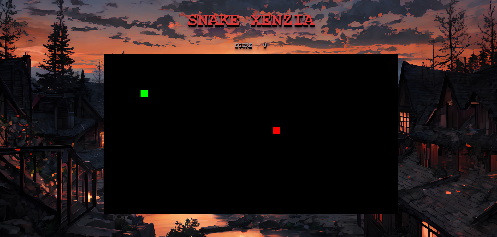
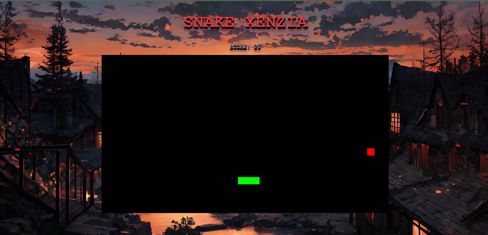

# Snake Xenzia Web Game

This is a web adaptation of the classic Snake Xenzia game. It is built using HTML, CSS, and JavaScript.

## How to Play

- Use the arrow keys to control the snake.
- The snake will move in the direction of the arrow key pressed.
- Eat the food (red block) to grow the snake.
- Avoid hitting the walls or the snake's own body.
- The game ends when the snake hits the wall or itself.

## Features

- Responsive design: The game is playable on desktop and mobile devices.
- Score tracking: The game keeps track of your score as you eat food.
- Game over alert: An alert is displayed when the game ends, showing your final score.

## Preview

## Try it Out

You can play the game [here](https://sithumsankajith.github.io/snake-xenzia-web/).

## How to Run Locally

To run the game locally, follow these steps:

1. Clone the repository: `git clone https://github.com/your_username/snake-xenzia.git`
2. Navigate to the project directory: `cd snake-xenzia`
3. Open the `index.html` file in a web browser.

